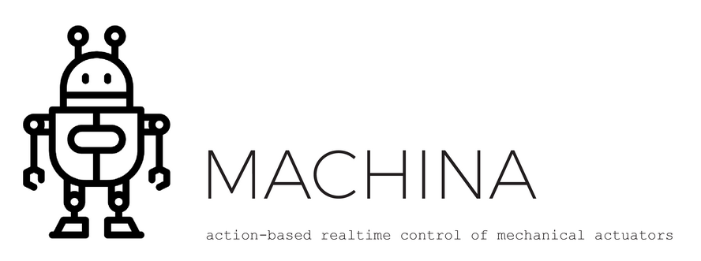
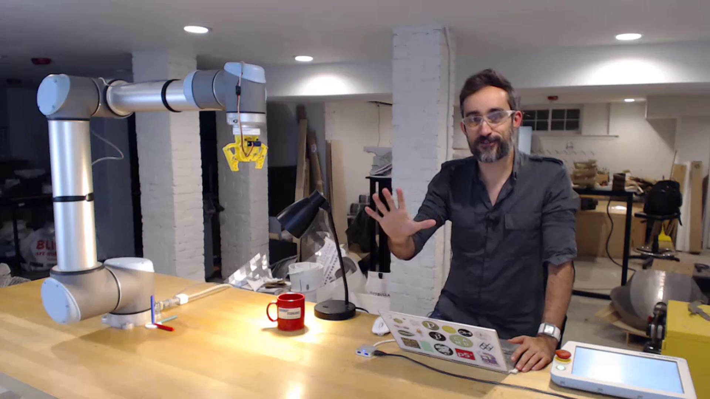

# Machina.NET
[](https://doi.org/10.5281/zenodo.1421943)



Machina is a .NET library for action-based real-time control of mechanical actuators.

Or in more _human terms_, it allows you to talk to a robot and tell it what to do.

Machina simplifies all the hassle of connecting to a mechanical controller, writing programs in platform-specific languages and managing the asynchronous communication between a machine and a connected application, by providing a [human-relatable API](https://github.com/garciadelcastillo/Machina/blob/master/Docs/Reference.md) of Actions, unified for all the different devices.

Machina was formerly known as _BRobot_.

## Disclaimer

__Working with robots is dangerous.__ Robotic actuators are very powerful machines, but for the most part extremely unaware of their environment; if it collides with something, including yourself, it will not detect it and try to keep going, posing a threat to itself and the operators surrounding it. This is particularly relevant when running in 'automatic' mode, where several security measures are bypassed for the sake of performance.

When using robots in a real-time interactive environment, please make sure:
- You have been __adequately trained__ to use that particular machine,
- you are in __good physical and mental condition__,
- you are operating the robot under the __utmost security measures__,
- you are following the facility's and facility staff's __security protocols__,
- and the robot has the __appropriate guarding__ in place, including, but not reduced to, e-stops, physical barriers, light curtains, etc.

__Machina is in a very early stage of development.__ You are using this software at your own risk, no warranties are provided herewith, and unexpected results/bugs may arise during its use. Always test and simulate your applications thoroughly before running them on a real device. The author/s shall not be liable for any injuries, damages or losses consequence of using this software in any way whatsoever.


## Hello World

Assuming your computer is [connected to a real or virtual robotic arm](https://github.com/garciadelcastillo/Machina/blob/master/Docs/Setting_up_RobotStudio.md), here is a simple .NET program that traces a vertical 50 x 50 mm square:

```csharp
// Load assembly
using Machina;

// Instantiate a new Robot object
Robot bot = Robot.Create("MyRobot", RobotType.UR);

// Do real-time streaming
bot.ControlMode(ControlType.Online);

// Connect to the controller and start running
bot.Connect();
bot.Initialize();

// Display a message on the handheld pendant
bot.Message("Hello world!");

// Move it to positive XYZ octant, face front and trace the square
bot.SpeedTo(100);
bot.PrecisionTo(2);
bot.MoveTo(300, 300, 300);
bot.Rotate(0, 1, 0, -90);
bot.Move(0, 0, 50);
bot.Move(0, 50, 0);
bot.Move(0, 0, -50);
bot.Move(0, -50, 0);
            
// ... let the robot complete these actions before shutting down

// kthxbye
bot.Disconnect();
```


## Documentation and Reference

Machina is its infancy, and rapid changes are happening with every commit! Your most reliable and up-to-date source of documentation is probably the code itself, and the comments within.

A full set of tutorials and associated projects can be found here:

[](https://www.youtube.com/playlist?list=PLvxxYImPCApXj3tHVKmpTS_AuMPngnA47)

Playlist: https://www.youtube.com/playlist?list=PLvxxYImPCApXj3tHVKmpTS_AuMPngnA47

Instructions on how to setup your machine to work with the Machina framework can be found here: https://www.youtube.com/playlist?list=PLvxxYImPCApUffcv_KtdR-sQydA4O4CPH.

_The following documentation is very outdated, and lot of things have changed since then._
To learn how to start using Machina, and examples of some of its features, please take a look at the [Walkthrough page](https://github.com/garciadelcastillo/Machina/blob/master/Docs/Walkthrough.md).

Documentation on Machina's API can be found on the [Reference](https://github.com/garciadelcastillo/Machina/blob/master/Docs/Reference.md).

A technical description of the project's goals and architecture is described here:

> García del Castillo y López, J.L., 2019. **Machina.NET: A Library for Programming and Real-Time Control of Industrial Robots.** _Journal of Open Research Software_, 7(1), p.27. DOI: http://doi.org/10.5334/jors.247 


## Related Projects

Machina comes with a bunch of sample projects that may help you understand its possibilities. Take a look at them, and please don't blame me if they broke during development... :sweat_smile:

A playlist of projects built by the community with different Machina flavors:
https://www.youtube.com/playlist?list=PLvxxYImPCApXZ-yBCUtGzVWb2ZhduaSXR

Here are some videos of things you can do with Machina:

- [Real-time Command-line Control](https://youtu.be/8jgYJddvkfg)
- [Trajectory Replication](https://youtu.be/09SHaaBKIi0)
- [Motion Mirroring](https://youtu.be/FryK_wDr-Gc)
- [Robot Drawing - Kids at Autodesk Day](https://youtu.be/hAxY0jyRVNE)
- [Robot Drawing - Real-time streaming](https://youtu.be/txlTEjiPtCw)
- [Real-time Movement through Video Game Controller](https://youtu.be/-8rCfHdKsPY)
- [Surface Milling](https://youtu.be/054s9XlslVs)
- [Metal Forming](https://youtu.be/_6Bbm7Scs4w)

There are other projects that use Machina at their core:

- [Machina for Dynamo](https://github.com/garciadelcastillo/Machina-Dynamo)
- [Machina for Grasshopper](https://github.com/garciadelcastillo/Machina-Grasshopper)
- [Robotic Drawing](https://github.com/garciadelcastillo/robot-drawing)


## Current Limitations

As of ~~v0.2.5~~ the latest version, Machina works for the following robotic arms in different degrees of robustness:

```text
ABB:    [=========  ]  (pretty solid both online and offline)
UR:     [========   ]  (also quite solid both online and offline)
KUKA:   [=====      ]  (recently launched online mode thanks to @Arastookhajehee! undertested, BE CAREFUL)
KUKA:   ------------>  (Known Bug: relative rotations result in unpredictable orientations! Avoid relative rotation!)
```

Other devices are currently under active development.
Much of the development has focused on making the best of what Machina can do, rather than fixing what it can't yet. There are several known limitations:
- No forward/inverse kinematics solvers. This means that robotic programs coming out of Machina include no arm configurations, and it is up to the controller to decide them. It also means that for motion actions, switching from `Joints` to any `Move` action and vice versa requires an absolute action first, which can then be followed by any relative actions of the same kind. See #11
- Closing Machina applications without properly disposing COM objects causes ABB controllers to silently reject variable subscriptions. Remember to always properly `Disconnect`, and if failed to do so... you may have to restart the machine.
- Many, many other things that you will discover along the way ;)


## Contribute

Machina is an open-source project, with a lot of room for improvement and collaboration. Furthermore, its internal modular architecture is designed to allow developers to implement their own drivers and compilers in a very straightforward way. If you would like to use Machina to control some [obscure Basic-based parallel robot](http://www.geva-roboter.at/files/rp_1adh_3adh_5adh_setup_and_maintenance.pdf), ping me and I will explain you how. A proper collaboration page should be up sometime soon...


## Acknowledgments

The development of Machina was sponsored by [Autodesk, Inc](https://www.autodesk.com/), as part of a summer research residency project in Boston, 2016. Please take a look at the [detailed list of acknowledgments](https://github.com/garciadelcastillo/Machina/blob/master/Docs/Acknowledgments.md)

Machina was created and is maintained by [Jose Luis Garcia del Castillo](http://www.garciadelcastillo.es).


## License

[MIT License](https://github.com/garciadelcastillo/Machina/blob/master/LICENSE.md)
